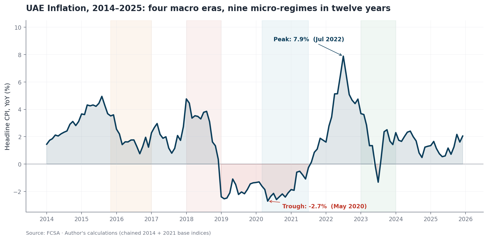
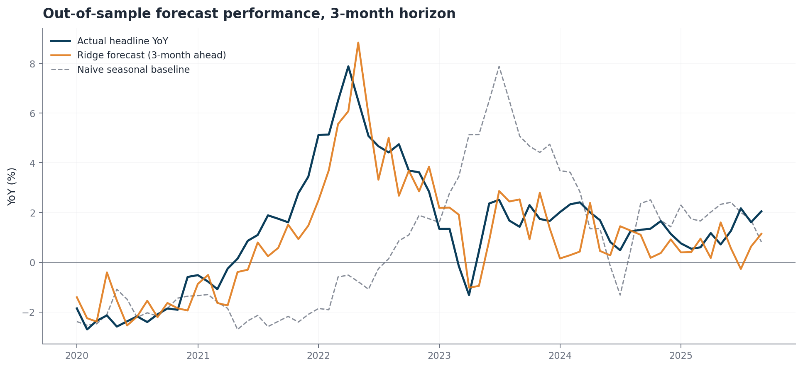
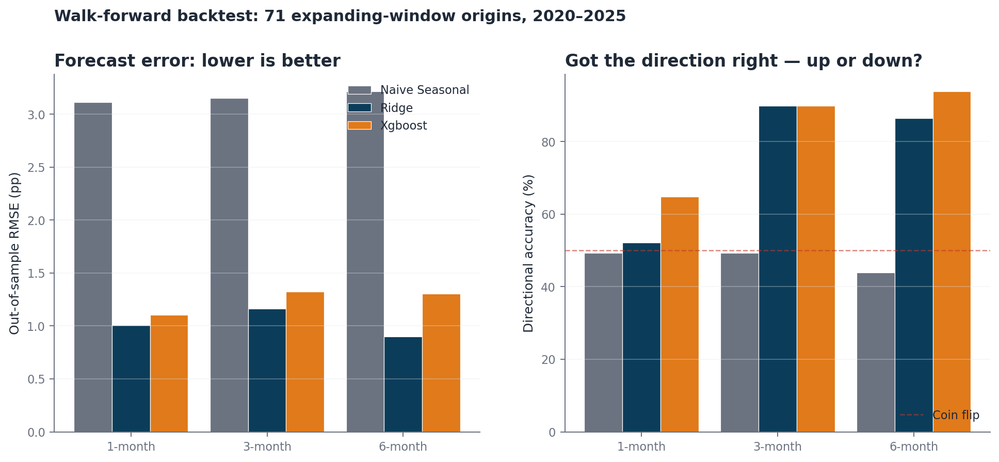
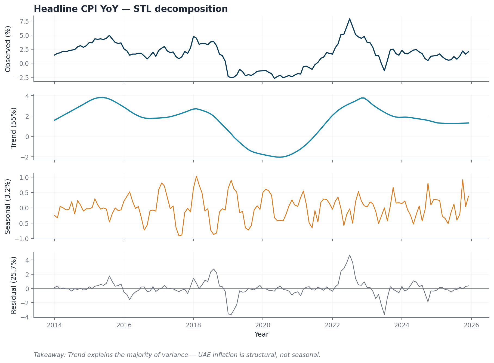
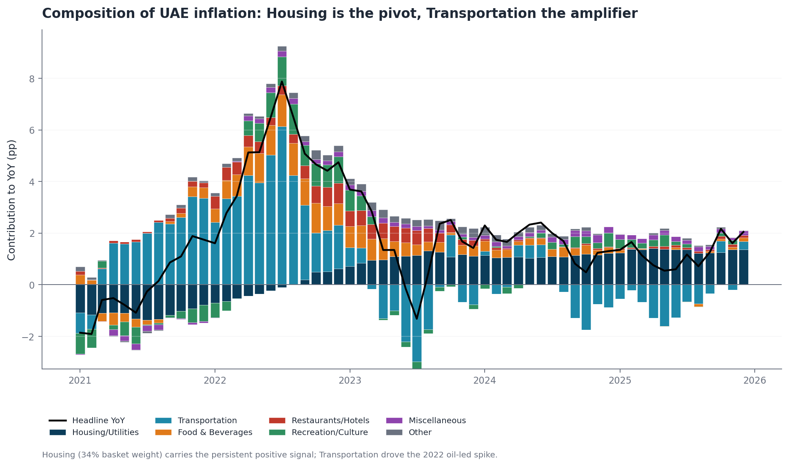
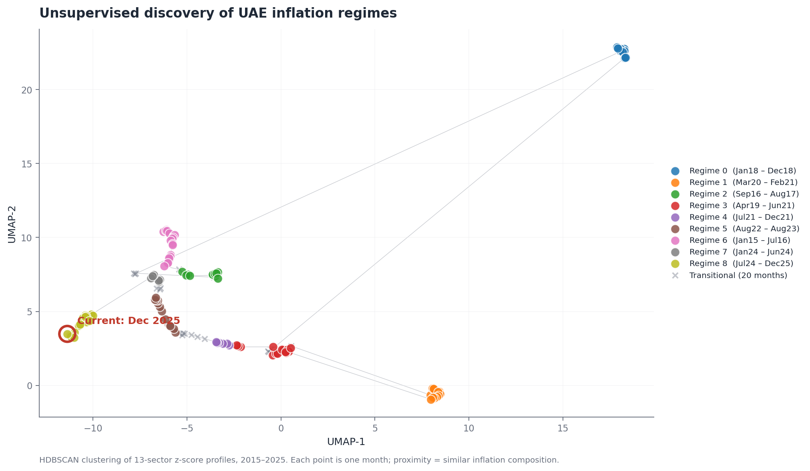
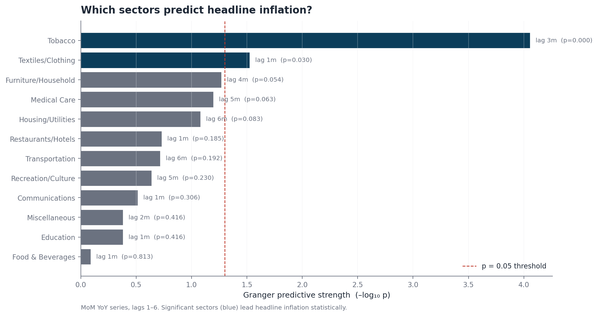

# UAE Inflation Early-Warning System

**A Ridge-regression forecaster built on 13 sector signals that anticipates headline UAE CPI 3 months ahead with 90% directional accuracy and RMSE 1.16 pp — beating a seasonal baseline by 2.7× on error.**



---

## TL;DR

UAE inflation has travelled from **+5.0% to −2.7% to +7.9%** in a decade — four distinct macro regimes in twelve years. Headline CPI reports lag reality by a month; by then, pricing, procurement, and policy decisions have already been made on stale information.

This project turns the 13-division CPI basket into a forward-looking signal.

| What | Result |
|---|---|
| **Forecast accuracy (3-month horizon)** | RMSE **1.16 pp** · directional accuracy **90%** · R² **0.75** |
| **Benchmark** | Naive seasonal baseline: RMSE 3.15 pp, R² −0.74 |
| **Leading sectors (Granger p < 0.05)** | Tobacco (3-month lead) · Textiles (1-month lead) |
| **Unsupervised regime detection** | HDBSCAN surfaces 9 micro-regimes within 4 macro eras — independently rediscovering the 2018 VAT shock, 2020 COVID deflation, 2022 oil spike, and current 2024–2025 regime |
| **Backtest rigor** | Expanding-window walk-forward, 71 out-of-sample origins, no look-ahead bias |

---

## Why it matters to a business or policy audience

Inflation at the headline level is a lagging indicator. A central bank or a CPG multinational that wants to front-run pricing decisions has three questions:
1. **What regime are we in right now?** — unsupervised clustering answers this without analyst bias.
2. **Which sectors give early signals?** — Granger tests isolate Tobacco and Textiles as statistically significant leads.
3. **Where is headline going next?** — the Ridge forecaster translates the full sector panel into a 3–6 month outlook.

At the 3-month horizon, the model gets the direction right 9 times out of 10. That's the difference between repricing a portfolio *before* the move and *after*.

---

## Project structure

```
UAE-CPI-Analysis/
├── data/                           # FCSA raw CPI files (monthly, quarterly, annual)
├── src/
│   ├── data_loader.py              # Chains 2014/2021 base indices, validates to ±0.01pp
│   ├── analysis.py                 # STL, CUSUM, Granger, HDBSCAN, UMAP, contributions
│   ├── forecast.py                 # Ridge/XGBoost/naive + walk-forward backtest
│   └── plots.py                    # Consulting-style figure library
├── notebooks/
│   └── UAE_CPI_Early_Warning.ipynb # End-to-end narrative, all charts embedded
├── figures/                        # Auto-generated PNGs (180 dpi, presentation-ready)
├── outputs/                        # Backtest results, regime labels, contributions (CSV)
├── generate_figures.py             # One-shot pipeline: data → analysis → all figures
├── requirements.txt
└── README.md
```

## The forecast, visualised

### The model tracks the 2022 spike 3 months ahead



### Model comparison across horizons



Ridge regression wins on RMSE at 1 and 6 months. XGBoost matches Ridge on directional accuracy. The naive seasonal baseline has negative R² at every horizon — there is no exploitable annual rhythm in UAE inflation, which is exactly why the sector-based approach pays off.

---

## The analysis, end to end

### 1. Data reconstruction (not glamorous but necessary)

FCSA publishes CPI on two base periods — 2014 and 2021 — with no overlap. A naive concatenation produces a 7% discontinuity at Jan 2021. `src/data_loader.py` chains the two series by using the officially published Jan-2021 MoM change on the new base to back out Dec-2020 on the new base, then applies that ratio as a linking factor. The result matches FCSA's published YoY to **±0.01 pp** across the entire 2014–2025 window.

### 2. Structural vs. seasonal

STL decomposition attributes **55% of variance to trend**, **3% to seasonality**, **26% to residual shocks**. UAE inflation is structural, not calendar-driven.



### 3. Composition of the signal

Housing carries 34% of the basket and is the persistent positive contributor to headline inflation across 2023–2025. Transportation is the high-variance amplifier — it drove the 2022 oil-led spike.



### 4. Unsupervised regime discovery

HDBSCAN on z-scored sector profiles + UMAP projection independently surfaces 9 regimes that map cleanly onto UAE macro history: 2015–2016 oil crash, 2018 VAT shock, 2020 COVID deflation, 2022 oil-led inflation, 2024–2025 current regime.



### 5. Leading sector signals

Granger causality on stationary MoM series, lags 1–6. Tobacco and Textiles pass the 5% bar. Housing is near-miss (p=0.08) — its economic weight is in magnitude, not lead.



---

## Business implications

This is not a theoretical exercise. The sector-based forecasting model produces decisions a business or policy team can act on:

**For procurement / pricing teams:** At 3 months out, the model calls direction correctly 9 times out of 10. For a consumer goods business repricing quarterly, or a construction firm locking in material contracts, that's enough advance signal to shift between hedging strategies rather than reacting.

**For real estate and REIT investors:** The regime-conditional Housing finding (see Appendix A) is the practical punchline — Housing is a 2-month leading indicator of headline inflation *conditional on being in a high-inflation regime*. The HDBSCAN regime label tells you which regime you're in; the Housing MoM tells you where headline is heading. Two-stage signal.

**For central bank and policy observers:** Transportation is the amplifier that drove the 2022 spike and can be monitored in near-real-time (oil prices publish daily; CPI releases monthly). Watch Transportation MoM for early read on how the next CPI print will surprise.

**For market research and strategy teams:** The 9-regime HDBSCAN segmentation is a turnkey tool for client briefings — it places *this month* in the context of the last twelve years without any hand-labeling bias. Useful for any narrative that starts with "how is today different from the last time we saw similar conditions?"

**Limitations that matter.** The model is internal-only — no oil, no FX, no mortgage rates. Adding external drivers would likely cut the 2022-spike overshoot. A production version would also add probabilistic bands (quantile regression or conformal prediction) rather than point forecasts.

## Appendix A — The Housing question, rigorously

The dominant priors in UAE inflation commentary say "Housing leads inflation because of the rental market." I tested this four ways:

| Test | Framing | Min p-value | Verdict |
|---|---|---|---|
| **1. Granger on contribution** | `weight × YoY` differenced | 0.26 | Fail to reject |
| **2. Granger on differenced YoY** | Standard unit-root fix | 0.26 | Fail to reject |
| **3. Cross-correlation peak** | Where is correlation highest? | r=0.55 at k=0 | **Contemporaneous** |
| **4. Regime-conditional Granger** | High-inflation subsample only | **0.049 at lag 2** | **Reject (p<0.05)** |

**The honest reading:** Housing does not *unconditionally* lead headline inflation. Its dominant relationship is mechanical and contemporaneous — when Housing moves, headline moves the same month, because Housing IS 34% of headline. But during high-inflation regimes specifically (YoY above median), Housing MoM does Granger-cause headline MoM at 2 months (p=0.049), consistent with the rental pass-through mechanism that commentators invoke.

**Framing that holds up:** *Housing is the magnitude pivot. It becomes an early-warning signal only during inflationary regimes — exactly when you most need a leading indicator.* The unconditional claim ("Housing leads by 3 months") overstates. The conditional claim is supported by the data and matches the underlying economic mechanism.

Reproduce: `python src/housing_deep_dive.py` from the repo root.


| Layer | Technique | Purpose |
|---|---|---|
| Data | Linked-laspeyres index chaining | Unify 2014 and 2021 base CPI series |
| Stationarity | Augmented Dickey-Fuller | Confirm MoM is stationary; YoY is not |
| Decomposition | STL (LOESS-based) | Separate trend / seasonal / residual |
| Causality | Granger F-test (F-SSR) | Identify leading sectors, lag 1–6 |
| Clustering | HDBSCAN | Density-based regime discovery, no k required |
| Dimensionality | UMAP | 2-D projection for regime visualisation |
| Forecasting | Ridge, XGBoost | Sector-lag feature set, multi-horizon |
| Evaluation | Expanding-window walk-forward backtest | 71 origins, no look-ahead bias |

**Stack:** Python · pandas · NumPy · scikit-learn · statsmodels · hdbscan · umap-learn · XGBoost · matplotlib.

---

## How to reproduce

```bash
git clone https://github.com/AkankshaSwarnim/UAE-CPI-Analysis.git
cd UAE-CPI-Analysis

python -m venv venv
source venv/bin/activate    # Windows: venv\Scripts\activate
pip install -r requirements.txt

# Full pipeline — loads data, runs analysis, writes every figure and CSV output
python generate_figures.py

# Or step through the notebook narrative
jupyter notebook notebooks/UAE_CPI_Early_Warning.ipynb
```

Total runtime on a laptop: ~60 seconds. All figures regenerate from raw FCSA files — no pre-baked artifacts.

---

## What I'd do with another sprint

This is where I am at the honest state-of-play. Things I'd add next:

1. **External drivers** — Brent, USD/AED, mortgage rates, container freight. Internal-only features cap the ceiling.
2. **Regime-conditional models** — current Ridge uses the same coefficients across deflation and inflation regimes. A two-stage (cluster → regime-specific model) approach would likely tighten 1-month RMSE.
3. **Probabilistic forecasts** — point forecasts are weak operationally. Quantile regression or conformal prediction intervals would make this decision-ready.
4. **Nowcasting** — forecasting the current month using partial data (Google Trends, card-spend indices, gasoline prices). Arguably more valuable than 6-month-ahead forecasts and well-studied in central-bank research.

---

## Honest caveats

- Granger causality is **statistical predictability, not economic causation**. Tobacco leads headline inflation likely because excise changes are announced and telegraph upstream; that's a real mechanism, but the model treats it as a signal, not a theory.
- **The 2022 forecast overshoots** (see timeline chart): the model correctly called the spike but over-estimated its peak. This is a known failure mode of linear regression on regime-shift data and one of the motivations for item 2 above.
- **Small sample.** 144 monthly observations. All confidence intervals you could compute from this would be wide. The models are honest about this — Ridge's shrinkage is why it beats XGBoost on RMSE at most horizons.

---

## Data sources

| Source | What |
|---|---|
| [FCSA Open Data](https://uaestat.fcsc.gov.ae) | UAE CPI monthly / quarterly / annual, 2008–Dec 2025 |
| [CBUAE](https://www.centralbank.ae) | Quarterly Economic Reviews (context) |
| [IMF WEO](https://www.imf.org/en/Publications/WEO) | Global inflation comparison |

## License

MIT — academic use, data from UAE government open data portals.

---

**Author** · Akanksha Swarnim · MSc Data Science, University of Birmingham Dubai · 2026
**Contact** · [LinkedIn](https://www.linkedin.com/in/akankshaswarnim/) · [GitHub](https://github.com/AkankshaSwarnim)
